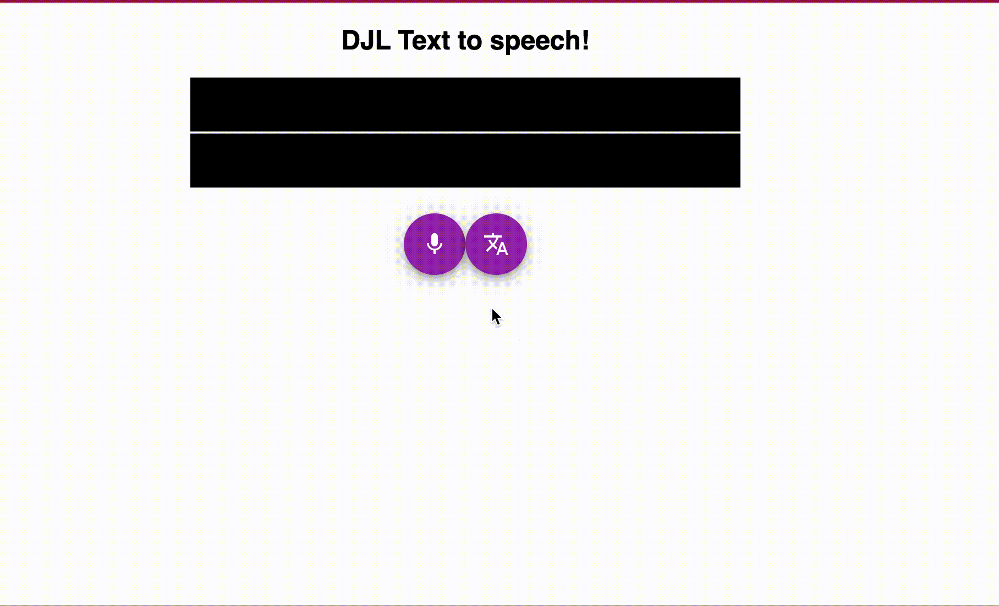

# DJL demo
A small demo app that showcase building a speech recognition application leveraging [Deep Java Library](http://djl.ai/). The app is composed of:
- Backend service: Spring boot app, loading `wav2vec` model and exposing a rest endpoint accepting an audio file and returning a string
- Frontend app: Built using react JS, enabling to record an audio input and calling the rest endpoint.

Both apps are for demo purposes only, and the code practices followed in this repo reflects that :) PRs are welcome.

## Running the app
### Requirements
- Java 17, maven, npm
### Downloading deps:
First build your backend application using `mvn clean package`. For the frontend run `npm i`. Both assumes that you're in the folder of each app.
### Starting apps
run the backend using `java -jar paht_to_your_jar`, and run `npm start` to start the front in dev mod. head to `http://localhost:3000` and have fun :)
### Build using Docker
TODO: This can be simplified using docker compose. 
